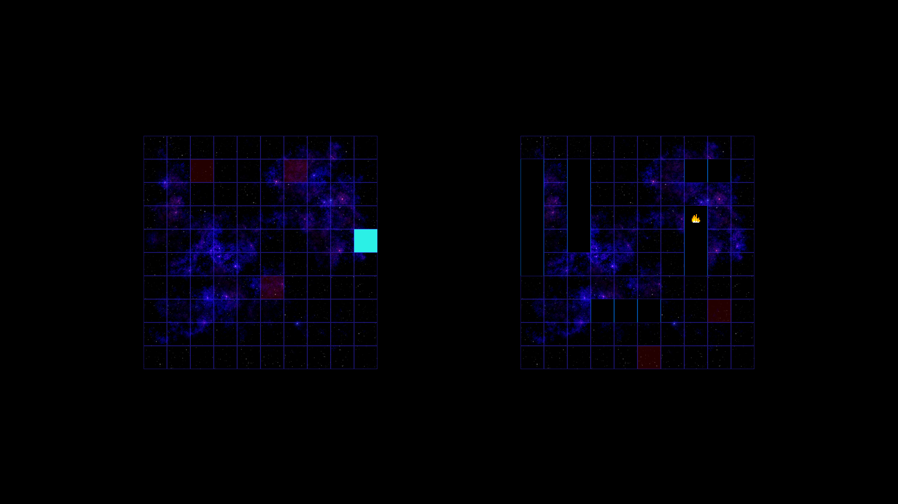

# BattleShip JS

Battle ship game built with JavaScript.
[View here](https://raw.githack.com/edwinmoradian90/battleship/development/dist/index.html)



## Getting Started

Clone repo and change to repo directory. 
Run: 
```bash
npm install
```

then 
```bash
npm run build
```

then open your browser to the specified localhost.

## Author

**Edwin Moradian** [Github](https://github.com/edwinmoradian90) | [LinkedIn](https://linkedin.com/in/edwin-moradian) | [Portfolio](https://edwin-moradian.firebaseapp.com)

## License

This project is licensed under the MIT License - see the [LICENSE.md](LICENSE.md) file for details
